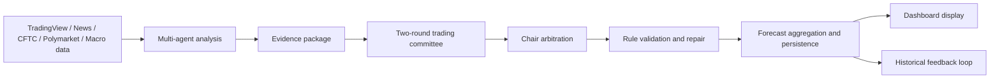

# Multi-Agent 预测分析看板

[English](README.md) | [中文](README.zh-CN.md)


Multi-Agent 预测分析看板 is an open-source **LangGraph** project for multi-agent XAU/USD research. It combines real-time gold prices, historical daily bars, news, macro data, alternative signals, and risk analysis into a coordinated workflow that produces structured entries, take-profit / stop-loss levels, time-window outlooks, and a final research conclusion.

It now also includes a **Two-Round Adversarial Trading Committee** layer and a **Prompt Registry / Prompt Template Management Layer** for the committee agents. The committee layer turns specialist analysis into an evidence package, runs a two-round bull vs. bear debate, and lets a chair agent arbitrate the final research posture. The prompt registry stores versioned English runtime prompts alongside Chinese maintenance translations so the committee prompts stay auditable, reviewable, and easy to evolve.

> This project is for research and decision support only. It is not investment advice and does not provide automated trading.

---

## Preview

<p align="center">
  
</p>

<p align="center">
  
</p>

<p align="center"><strong>黄金日线结构</strong></p>

<p align="center">
  
</p>

---

## What this project does

- Provide daily entry, take-profit, and stop-loss levels, plus outlooks for the next 3 days, 3-5 days, 6-15 days, and 15+ days
- Fetch TradingView XAU/USD realtime quotes and daily snapshots
- Ingest historical daily bars as the foundation for indicator computation and evaluation
- Run specialized agents from technical, macro, news, sentiment, alternative-data, and risk perspectives
- Aggregate their outputs into a single structured forecast
- Display current price, daily direction, confidence, entry / take-profit / stop-loss, time-window outlooks, and research summaries in the frontend dashboard
- Persist research runs, forecasts, agent states, and feedback loops

---

## Multi-agent roles

| Agent | Role | Focus |
| --- | --- | --- |
| `technical` | Technical analysis | Price structure, trend, patterns, moving averages, RSI, ATR, smart-money logic |
| `macro` | Macro analysis | Dollar index, rates, inflation, liquidity, and broader macro conditions |
| `news` | News analysis | News flow, sentiment, event impact, and representative Chinese headlines |
| `market_sentiment` | Market sentiment analysis | Combined sentiment from RSI, CFTC positioning, news flow, Polymarket, and historical feedback |
| `alt_data` | Alternative data analysis | Pizza Index, macro signals, and other supplemental indicators |
| `risk` | Risk analysis | Volatility boundaries, drawdown / rebound risk, key price levels, and defensive posture |
| `forecast` | Final aggregation | Merge all agent outputs into the final direction, trade levels, and time-window outlook |
| `bull / bear` | Trading committee debate | Build evidence-backed opening, rebuttal, and final positions from the evidence package |
| `chair` | Trading committee chair | Arbitrate the final bias, actionability, and trade plan |
| `repair` | Committee repair | Apply conservative fixes when validation fails |

## Two-Round Adversarial Trading Committee

The committee layer is intentionally structured and bounded:

1. Specialist agents produce independent analysis first.
2. `node_build_evidence_package` consolidates the specialist output into a normalized evidence package.
3. Round 1 opening cases are produced by the bull and bear agents in parallel.
4. Round 2 rebuttals respond point-by-point to the opposite opening case.
5. Final positions state whether each side still stands by its view or downgrades to observe-only / no-trade.
6. The chair agent arbitrates the final bias, actionability, and trade plan.
7. A rule-based validator checks the chair decision, and a repair agent can make one or two conservative corrections if needed.

All committee reasoning must stay inside the evidence package. Committee prompts are loaded from the Prompt Registry and are not hard-coded in Python.

## Prompt Registry / Prompt Template Management Layer

The Prompt Registry stores committee prompts in the database with:

- versioned prompt keys
- English runtime prompt text for the LLM
- Chinese maintenance translations for review and auditing
- active-version lookup
- prompt metadata such as prompt type, node name, model family, and output schema reference

This makes committee prompts easier to review, safer to update, and simpler to trace back to the exact version used for a given research run.

---

## Third-party data sources and tools

| Data source / tool | Purpose |
| --- | --- |
| TradingView | Realtime XAU/USD quote, daily snapshot, and price reference |
| Reuters / NewsFlow | Mainstream news flow, sentiment, and representative headlines |
| CFTC | Positioning / COT-related inputs |
| Polymarket | Event probabilities and market expectation signals |
| Pizza Index | Alternative market sentiment indicator |
| Macro data | Treasury yields, CPI, Fed funds, and other macro inputs |
| Historical feedback | Previous forecast outcomes and evaluation feedback |
| Local daily bars | Completed daily-bar inputs for evaluation and indicator foundations |
| Technical indicator tools | SMA, EMA, RSI, ATR, and volatility-structure calculations |

---

## Workflow at a glance



1. Load local market data and the latest quote snapshot
2. Compute technical indicators and structural signals
3. Run the analysis agents by domain
4. Consolidate specialist outputs into an evidence package
5. Run the two-round adversarial trading committee
6. Validate and repair the chair decision when needed
7. Persist the final structured forecast for later review and feedback evaluation
8. Render the latest result in the frontend dashboard

---

## Why it is designed this way

- **LangGraph** provides explicit orchestration for the multi-agent workflow
- **Structured outputs** make each agent result safe to render in the frontend
- **Separation of tools and data sources** keeps inputs, reasoning, and outputs decoupled
- **Historical feedback loops** turn the forecast into a repeatable research process, not a one-off text output

---

## Planned enhancements

- Add historical evaluation analysis so past forecasts can be reviewed from a richer time-series perspective
- Expand the research view with longer-horizon retrospective comparisons and performance summaries
- Use historical context to compare how agent conclusions evolve across different market regimes

---

## Development stack

The project uses the following tools and workflow helpers:

- **Codex**: code authoring, debugging, refactoring, and frontend iteration
- **OpenSpec**: change definitions, design boundaries, and implementation scope
- **Superpowers**: brainstorming, planning, execution discipline, and quality checks
- **ui-ux-pro-max**: dashboard and README visual review, layout guidance, and style consistency

---

## Run and configuration

The local setup reads from `dev.env` by default. The Chinese README and this English README share the same project structure and scope.

If you prefer Chinese documentation, switch to [中文 README](README.zh-CN.md).

---

## Local startup

1. Start local infrastructure with Docker Compose:

```bash
docker compose up -d
```

This uses the repository-level [`docker-compose.yml`](docker-compose.yml) to start PostgreSQL for local persistence.

2. Start the backend API:

```bash
uv run uvicorn goldfxgraph.api.app:create_app --factory --host 0.0.0.0 --port 8000 --reload
```

3. Start the frontend dashboard:

```bash
cd apps/web
npm install
npm run dev
```

The frontend runs on [http://localhost:5173](http://localhost:5173) and talks to the backend through `VITE_API_BASE_URL=http://localhost:8000`.

---

## Disclaimer

Multi-Agent 预测分析看板 is not a trading system.

This project does not provide financial advice, investment recommendations, trading signals, or automated execution. All outputs are for research, learning, and workflow exploration only.

---

## License

MIT
