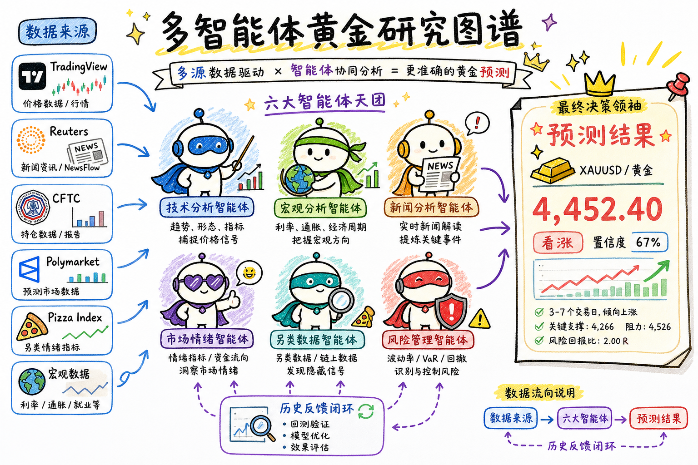
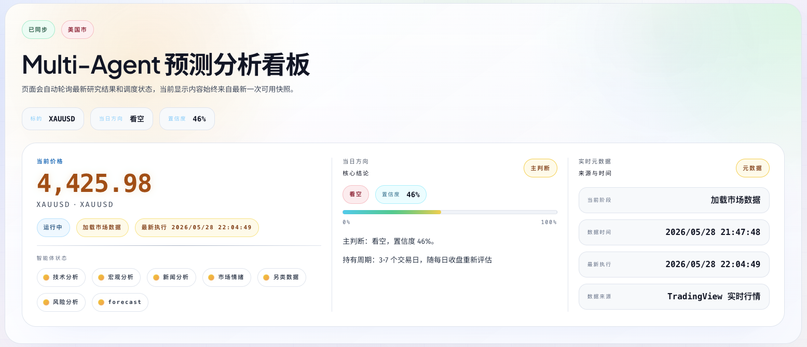
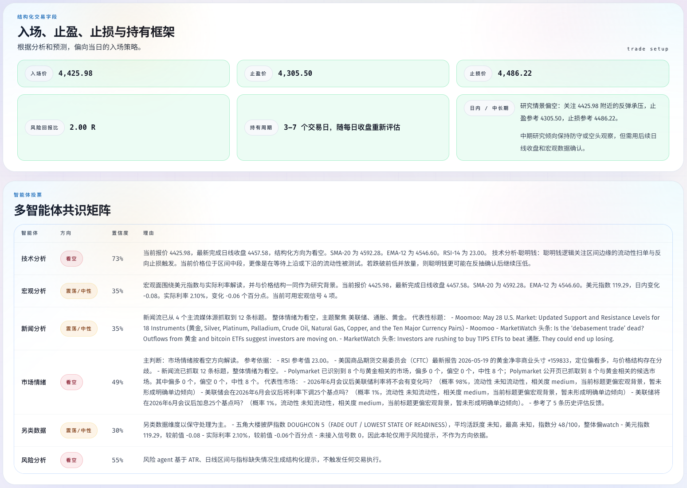
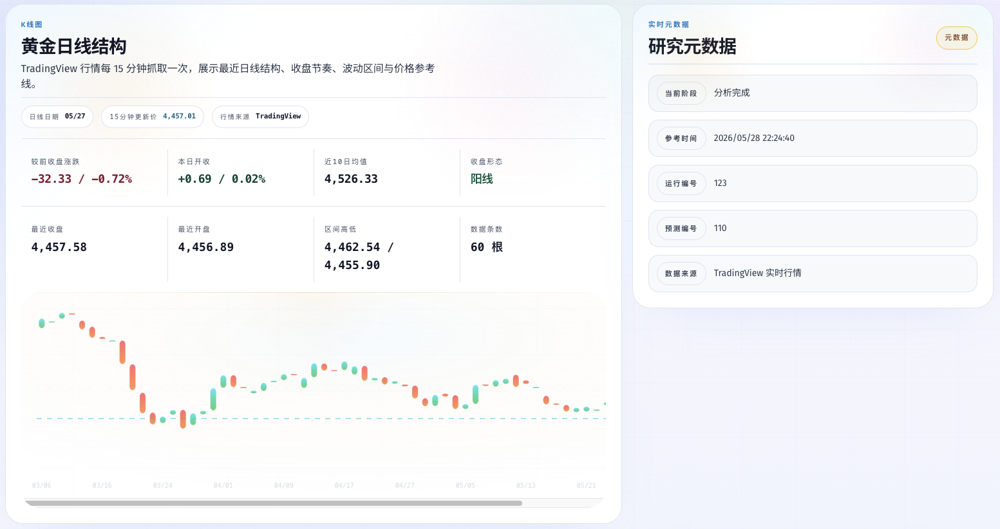
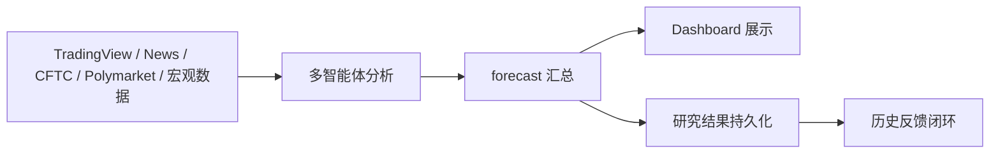

# Multi-Agent 预测分析看板

[English](README.md) | [中文](README.zh-CN.md)



Multi-Agent 预测分析看板 是一个基于 **LangGraph** 的开源 XAU/USD 多智能体协同研究项目。它把实时金价、历史日线、新闻、宏观、另类数据和风险分析拆成多个专业 agent，由工作流统一编排，最终输出结构化的入场点位、止盈、止损、时间窗判断和综合结论。

> 该项目仅用于研究和决策支持，不构成投资建议，也不提供自动交易。

---

## 预览

<p align="center">
  
</p>

<p align="center">
  
</p>

<p align="center"><strong>黄金日线结构</strong></p>

<p align="center">
  
</p>

---

## 这个项目能做什么

- 提供当日入场、止盈、止损点位，以及未来 3 天、3-5 天、6-15 天、15 天以上的走势预测
- 获取 TradingView 的 XAU/USD 实时行情与日线快照
- 读取历史日线 bar 作为指标计算和研究评估的基础输入
- 让多个 agent 分别从技术、宏观、新闻、市场情绪、另类数据和风险视角给出结论
- 汇总成统一的结构化 forecast
- 在前端 Dashboard 中展示当前价格、当日方向、置信度、入场 / 止盈 / 止损、时间窗判断和研究结论
- 保存 research run、forecast、agent 状态和反馈闭环

---

## 多智能体分工

| Agent | 作用 | 主要关注点 |
| --- | --- | --- |
| `technical` | 技术分析 | 价格结构、趋势、形态、均线、RSI、ATR、聪明钱逻辑 |
| `macro` | 宏观分析 | 美元指数、利率、通胀、流动性和宏观环境 |
| `news` | 新闻分析 | 主流新闻流、新闻情绪、事件影响、代表性中文标题 |
| `market_sentiment` | 市场情绪分析 | RSI、CFTC 持仓、新闻流、Polymarket、历史反馈的综合情绪 |
| `alt_data` | 另类数据分析 | Pizza Index、宏观信号、链上/旁路类补充信号 |
| `risk` | 风险分析 | 波动边界、回撤/回抽风险、关键价格位和防守策略 |
| `forecast` | 最终汇总 | 将各 agent 结果合成为最终方向、入场/止盈/止损和时间窗判断 |

---

## 第三方数据源与工具

| 数据源 / 工具 | 用途 |
| --- | --- |
| TradingView | 实时 XAU/USD 行情、日线快照、价格参考 |
| Reuters / NewsFlow | 主流新闻流、新闻情绪、代表性标题 |
| CFTC | 持仓 / COT 相关信息 |
| Polymarket | 市场预期与事件概率信号 |
| Pizza Index | 另类市场情绪指标 |
| 宏观数据 | 美债收益率、CPI、联邦基金利率等 |
| 历史反馈 | 过往 forecast 结果与评估反馈 |
| 本地日线数据 | 已完成日线 bar、回测和指标计算的基础输入 |
| 技术指标工具 | SMA、EMA、RSI、ATR、波动结构计算 |

---

## workflow 一眼看懂



1. 先加载本地市场数据与最新行情快照
2. 再计算技术指标和结构信号
3. 然后按领域依次运行多个分析 agent
4. 最后由 `forecast` 节点汇总所有意见，生成结构化预测
5. 研究结果会被持久化，供后续回看和反馈评估
6. 前端 Dashboard 读取最新结果并实时展示

---

## 为什么这样设计

- **LangGraph** 负责显式编排多智能体 workflow
- **结构化输出** 让每个 agent 的结论都能被前端稳定渲染
- **工具和数据源分离** 让数据输入、分析逻辑和最终结果互相解耦
- **历史反馈闭环** 让预测不是一次性文本，而是可以持续评估和迭代的研究过程

---

## 后续规划

- 增加历史评估分析，让过往 forecast 可以从更丰富的历史维度复盘
- 扩展研究视图，加入更长周期的回顾对比和表现总结
- 利用历史上下文观察不同市场阶段下 agent 结论如何演化

---

## 开发方式

本项目的代码协作和产品迭代主要基于以下工具链：

- **Codex**：用于代码编写、调试、重构和前端视觉迭代
- **OpenSpec**：用于定义变更、设计方案和实施范围
- **Superpowers**：用于头脑风暴、计划编写、执行节奏和质量检查
- **ui-ux-pro-max**：用于 Dashboard 和 README 视觉表达的设计审查与风格统一

---

## 运行与配置

本地配置默认读取 `dev.env`，`README.md` 和 `.env.example` 提供了英文版说明。
如果你更习惯英文文档，也可以直接切换到 [English README](README.md) 查看。

---

## 本地启动

1. 使用 Docker Compose 启动本地基础设施：

```bash
docker compose up -d
```

这会使用仓库根目录下的 [`docker-compose.yml`](docker-compose.yml) 启动 PostgreSQL，作为本地持久化存储。

2. 启动后端 API：

```bash
uv run uvicorn goldfxgraph.api.app:create_app --factory --host 0.0.0.0 --port 8000 --reload
```

3. 启动前端 Dashboard：

```bash
cd apps/web
npm install
npm run dev
```

前端默认运行在 [http://localhost:5173](http://localhost:5173)，并通过 `VITE_API_BASE_URL=http://localhost:8000` 访问后端。

---

## 免责声明

Multi-Agent 预测分析看板 不是交易系统。

本项目不提供金融建议、投资建议、交易信号或自动化交易执行。所有输出仅用于研究、学习和工作流探索。

---

## License

MIT
